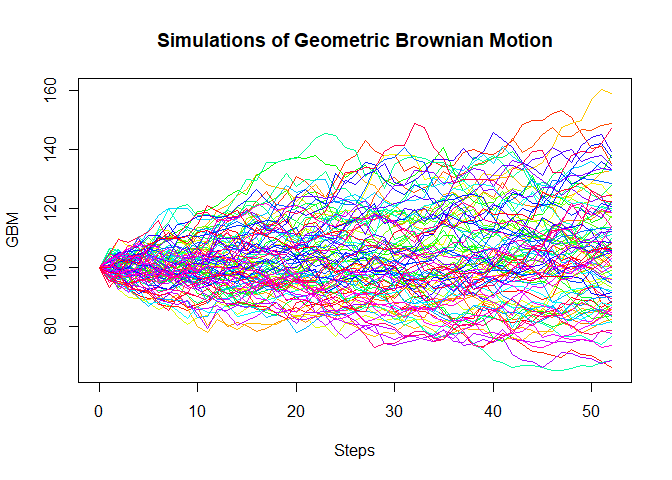

<!-- README.md is generated from README.Rmd. Please edit that file -->

# CompStat.Package

<!-- badges: start -->

[](https://github.com/marcusaaskoven/CompStat.Package/actions/workflows/R-CMD-check.yaml)
<!-- badges: end -->

The goal of CompStat.Package is to …

## Installation

You can install the development version of CompStat.Package from
[GitHub](https://github.com/) with:

``` r
# install.packages("devtools")
devtools::install_github("marcusaaskoven/CompStat.Package")
```

## Example

How to generate simulations of Geometric Brownian Motion and calculate a
Black-Scholes option price, delta and gamma

``` r
library(CompStat.Package)
## Simulate and plot GBM
GBM <- simulate_GBM(100, 0.02, 0.02, 0.2, 1000, 52)
plot(GBM)
```



``` r

## Generate BS options price, delta and gamma
x <- BS_option(100, 100, 0.02, 1, 0.2, 'C')
print(x)
#>   Black.Scholes.options.price Black.Scholes.delta Black.Scholes.gamma
#> 1                    8.916037           0.5792597          0.01955213
summary(x)
#> Input parameters:
#>             Parameter Value
#> 1       Initial price   100
#> 2        Strike price   100
#> 3       Interest rate  0.02
#> 4 Time until maturity     1
#> 5  Implied volatility   0.2
#> 6      Call(C)/Put(P)     C
#> 
#> Black-Scholes output:
#>   Output Value
#> 1  Price 8.916
#> 2  Delta 0.579
#> 3  Gamma 0.020
```
